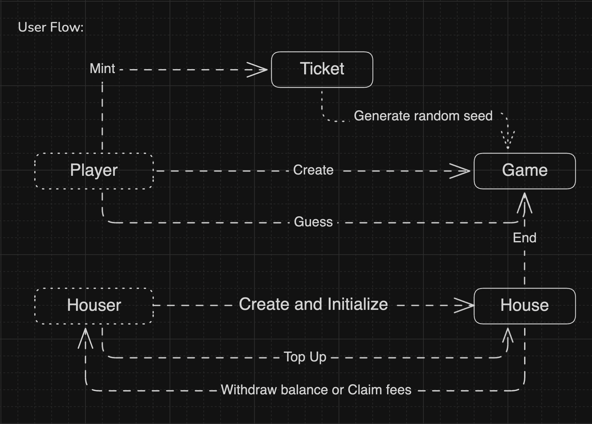

# DAPP Practice
Use the coin flip game as example to demonstrate how to build a DApp and interact with a smart contract.

## Coin flip Game Logic



Accounts:
- **Player**: Represents the user participating in the game.
- **House**: Represents the project owner and has control over the house operations.

Objects:
- **Ticket**: Serves as the entry pass to the game and records the elements of random number generation.
- **Game**: Represents the game entity, recording user play data.
- **House**: Represents the casino entity, recording game rules and house data.

Actions:
- **Create and Initialize House**: Before constructing the DApp, create and initialize the house data.
- **Top-up Balance from House**: Deposit when the house's principal for betting against users is insufficient.
- **Withdraw Balance from House**: Withdraw the betting principal when closing the house.
- **Claim Fees from House**: Claim the game fees at any time.
- **Mint Ticket**: Players need to obtain a ticket to proceed to the next steps.
- **Create Game**: Start a guessing game after obtaining the ticket and placing a bet.
- **Guess Game**: Start guessing heads or tails after creating the game.
- **End Game**: The house ends the game and announces the result. If the player wins, take the bet minus the fee; if the house wins, take all the bets.

## Project structure

- `dapp/coin-flip` folder: Front-end code for the DApp in this demo.
- `program` folder: Sui Move code for the contract in this demo.
- `document` folder: All the resources used in the readme are concentrated here.

### Dapp structure
Built on the base of a DApp created using `pnpm create @mysten/dapp --template react-client-dapp`.

- `src/components` folder contains all the components. Components related to game are prefixed with "House" and "Player."
- `src/hooks` folder contains hooks provided by the app provider, as well as hooks for fetching contract data.
- `constants.ts` file for defining constants. Fill in these constants after executing the program script.
- `utils.ts` contains some commonly used utility functions.
- `App.tsx` is the main layout of the DApp.
- `main.tsx` is the entry point for the DApp website.

### Program structure
Use TypeScript to build, publish, and update packages, and interact with them. Additionally, some improvements have been made to the program structure to make it more user-friendly.

- `coin_flip/sources` folder contains all the move package code.
- `coin_flip/publish-result.${networkType}.json` contains the important object ids of the package for each network type.
- `coin_flip/Move.${networkType}.toml` is the toml file for each network type.
- `coin_flip/Move.toml` is the default toml file, it will be used if the `Move.${networkType}.toml` for the current network type is not found.
- `scripts` folder usually contains the typescript code that will be used to manage packages & interact with the contract.
- `.env.example` template for defining environment variables.


## How to setup Environments

### Setup Dapp

1. Start your DApp development by following the instructions in `dapp/coin-flip/README.md`.
2. After contract publishing, fill in `PROGRAM_ID` and `HOUSE_CAP_ID`, and after the house is created and initialized, fill in `HOUSE_DATA_ID` and `HOUSE_PRIV_KEY`.

### Setup Program
1. Install npm packages for running program scripts.
   
    ```bash
    pnpm install
    ```

1. Install SUI CLI: See the official documentation: [Install SUI](https://docs.sui.io/guides/developer/getting-started/sui-install)

2. Set the envs, then input one of your secret key or mnemonics
   
    ```bash
    cp .env.example .env
    ```
     - `SECRET_KEY`: The private key of the account that will be used to manage the packages, make sure the account has enough SUI to pay for the transaction fees.
     - `MNEMONICS`: Another way to use your account.

3. Run scripts to deploy your contract:
    
    - Run `scripts/publish` to deploy your coin_flip contract.
    - Run `scripts/house-init` to create and initialize your house data.
    - Retrieve the object IDs from the contract in `coin_flip/publish-result.${networkType}.json` and fill them into the constants in the DApp.

### Referance
- Sui Document App Sample: https://docs.sui.io/guides/developer/app-examples/coin-flip